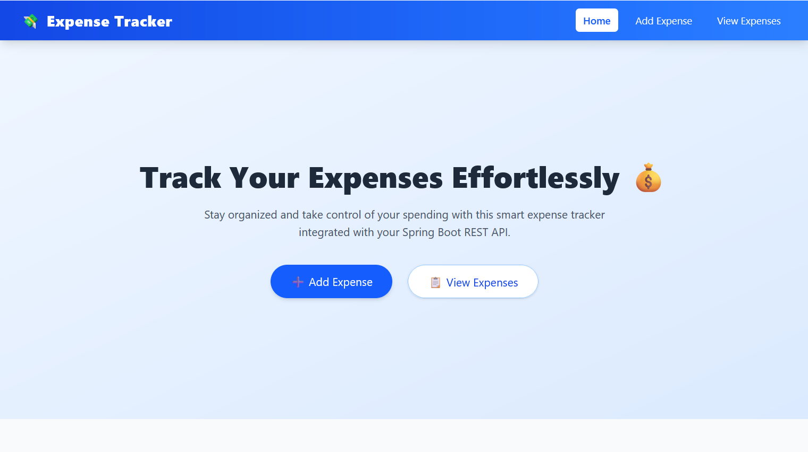

# Expense Tracker

A full-stack Expense Tracker app to manage personal expenses.  
Backend: Spring Boot | Frontend: React.js

## Features
- Add, edit, delete, and view expenses
- Filter by category or date range
- View total expenses
- Simple responsive UI

## Setup

### Backend
cd backend  
mvn clean install  
mvn spring-boot:run  

### Frontend
cd frontend  
npm install  
npm start  

App runs at http://localhost:3000 and backend at http://localhost:8080.

## API Endpoints
- POST /api/expenses – Add expense  
- GET /api/expenses – Get all expenses  
- GET /api/expenses/{id} – Get expense by ID  
- PUT /api/expenses/{id} – Update expense  
- DELETE /api/expenses/{id} – Delete expense  
- GET /api/expenses/category/{category} – Filter by category  
- GET /api/expenses/total – Get total amount
